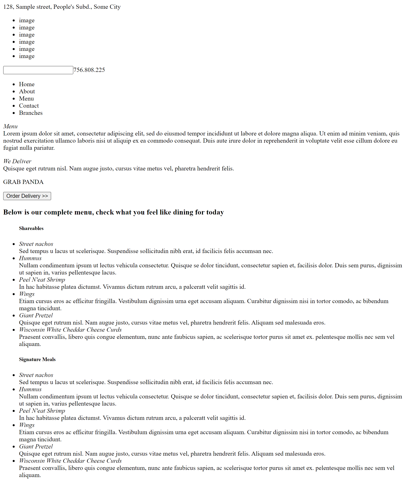
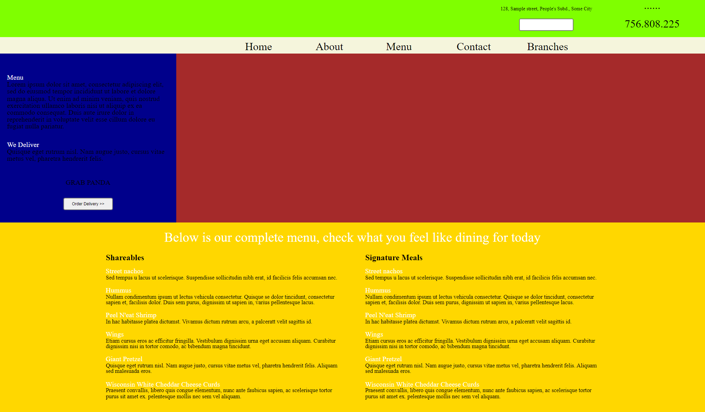
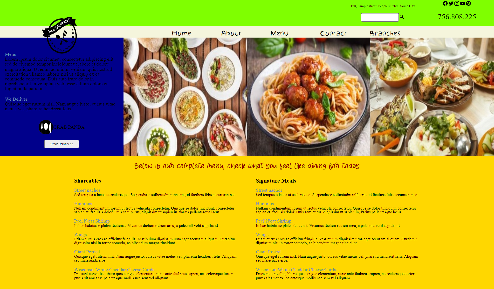

# Restaurant Page

## Description
A 'TOP' Javascript course project which covers Javascript modules and the webpack usage

### Prospected webpage layout with basic css styling

### HTML elements bundled and loaded by JS's webpack

### CSS bundled and loaded by JS's webpack

### Images and Fonts bundled and loaded by JS's webpack

## JS lessons covered
- Node Package Manager (npm)
- Webpack
- ES6 module

## Extra Learnings
- Easy updating of app's Github live preview using webpacks bundled subfolder(dist)

## Reflection
- Web pack and ES6 module is convenient to use and it has an easy to understand documentation.

## Project Link
- https://www.theodinproject.com/lessons/javascript-restaurant-page
